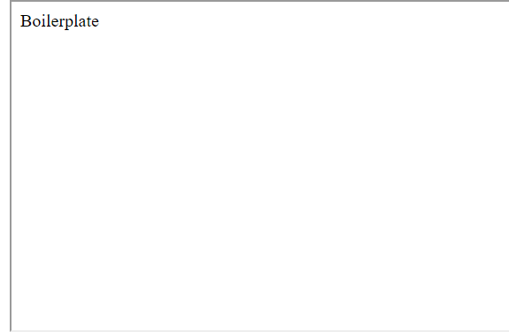
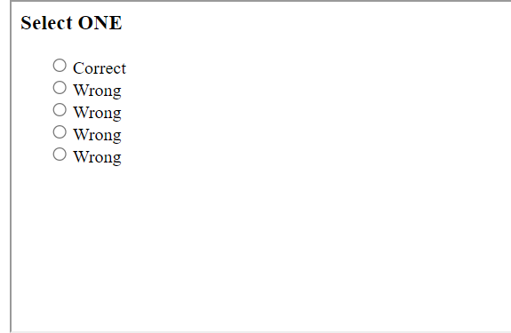
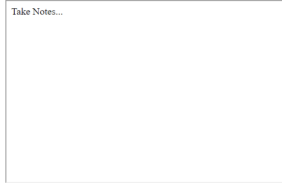
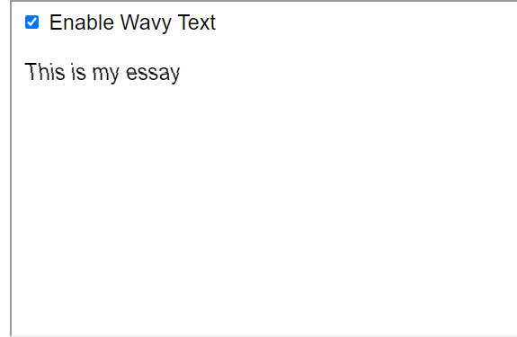

# Arbitrary-HTML

🌐 [View Online!](https://ethandawes.github.io/arbitrary-html/#edit=)

Arbitrary-HTML allows you to embed custom HTML code without a server. The code is stored in the URL and rendered with a service worker.
No coding experience is required, as the preview is editable by default. I used this to make my [Canvas](https://www.instructure.com/canvas) posts more interesting.

## Templates
### Boilerplate
Basic `html`, `head` and `body` tags, with a script that runs on DOM ready

### Gradient
Background that changes color

### Markdown editor
Don't want to write HTML & know markdown? This template will do that & hide the source in the final view

### Blink
Throwing back the clasic HTML `<blink>` element, this will flash your text at a specified frequency

### Typer
Writes out your message when you click "show"

### Quiz
Customize several answer choices that highlight if wrong/correct

### Canvas
If your school uses Canvas, this may confuse a few people

### Notes
If you have something you want to remember but it's not important enough for a Google doc, write it here. Will persist over browser restarts because your content is in the url.

### Text to Speech
Click buttons to read your message out loud!

### Wave
Render text with an animated wavy effect

### Terminal
Write a message on the terminal, complete with a few working commands!

### Month Calendar
Create & print full-page calendars

### Schedule
Create & print full-page schedules

### Week Calendar
Create & print full-page calendars

